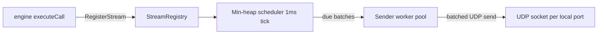

# High-scale cleartext RTP generation

Gossipper can drive thousands of parallel **cleartext synthetic** RTP streams toward a single SBC or media gateway (for example 10,000 PCMU streams at 20 ms packetization) without the per-stream goroutine and ticker model used by the default media layer.

This document describes the problem, the recommended approach, how to use **`-media_scale`**, and how the implementation fits into the codebase.

For a short operational cheat sheet, see also [`media-scale.md`](media-scale.md).

---

## Summary

| Topic | Recommendation |
|-------|----------------|
| **Goal** | Send-only cleartext RTP load (synthetic silence) to one or few peers |
| **Enable** | `-media_scale` |
| **Standalone** | `-rtp_send -media_scale -rtp_streams N` |
| **Scenarios** | `exec rtp_stream="synthetic,…"` with `-media_scale` |
| **Not supported in scale mode** | SRTP/DTLS, PCAP/mic/echo, per-packet HEP RTP, RTCP/recv loops |
| **Kernel bypass (XDP/eBPF)** | Not used for this path; userspace scheduler + batched UDP send is sufficient for ~500k pps |

---

## Problem: default media model

Each active RTP flow in the classic [`Session`](../internal/media/media.go) path typically has:

- One `net.ListenUDP` socket bound to `[media_port]` (per call: `localPort + 2 + (callNumber-1)*2` in [`engine.go`](../internal/engine/engine.go));
- A dedicated `streamLoop` goroutine with its own **`time.Ticker`** (default 20 ms);
- One **`WriteTo`** syscall per packet;
- In full dialog mode: additional goroutines for RTP receive, RTCP send, and RTCP receive (roughly 3–6 goroutines per stream).

At **10,000 streams** and **50 packets per second per stream** (20 ms PCMU):

| Metric | Approximate value |
|--------|-------------------|
| Aggregate packet rate | **~500,000 UDP packets/s** |
| Payload size | ~12 B RTP header + 160 B PCMU ≈ **~80–100 Mbps** |
| Goroutines (classic path) | **~30k–60k** (streams + SIP) |
| Syscalls | **~500k `WriteTo`/s** without batching |

On modern hardware the **NIC bandwidth is not the bottleneck**. Scheduling overhead (tickers, goroutines, mutex traffic in `Session`) and syscall rate are.

---

## Why not XDP / AF_XDP / eBPF first?

These technologies excel at **ingress** processing (filtering, redirect, mirroring at line rate) or a **small number of very high-rate flows**. They are a poor first fit for **generating** thousands of independent RTP flows from userspace:

| Technology | Strong fit | Weak fit for gossipper send-only load |
|------------|------------|--------------------------------------|
| **XDP redirect** | Ingress filter, DDoS, mirror to userspace | RTP state (SSRC, seq, timestamp) lives naturally in the generator |
| **AF_XDP** | Few flows, zero-copy RX/TX rings | 10k distinct 5-tuples and local ports complicate UMEM and binding |
| **eBPF** | Per-flow stats, drop rules | Does not remove userspace RTP state |
| **DPDK** | Sustained multi‑Mpps | Overkill for ~0.5 Mpps cleartext |

XDP may become relevant **later** if you need to **mirror** many inbound RTP streams to Homer without userspace receive—not for cleartext load generation.

---

## Solution: `ScaleEngine`

Implementation: [`internal/media/scale_engine.go`](../internal/media/scale_engine.go).



### Components

1. **`scaleStream`** — compact per-flow state: local/remote endpoints, prebuilt RTP template (synthetic silence), sequence/timestamp, next send time, `*net.UDPConn`.
2. **Scheduler** — one goroutine, 1 ms tick, **min-heap** ordered by `nextSendAt`; no per-stream tickers.
3. **Sender pool** — worker goroutines drain a queue; packets grouped by socket; buffers from `sync.Pool`; Linux path batches via grouped `WriteTo` (structure allows future `sendmmsg`).
4. **Scale mode constraints** — no `rtpReceiveLoop`, `rtcpLoop`, or HEP observer on the hot path; **synthetic cleartext only**.

### Expected effects

- Goroutine count **O(workers)** instead of **O(streams)**.
- Syscall pressure reduced by batching sends per socket.
- Memory churn reduced via buffer pool and in-place RTP header patching (sequence, timestamp).

---

## CLI and configuration

| Flag | Description |
|------|-------------|
| **`-media_scale`** | Enable `ScaleEngine` for eligible RTP actions |
| **`-rtp_streams N`** | With `-rtp_send -media_scale`, start **N** parallel streams (local ports increment by 2) |

**Validation:**

- `-media_scale` cannot be combined with **`-media_srtp`**.
- `-rtp_streams` > 1 requires **`-media_scale`**.

Engine wiring: [`internal/engine/engine_scale.go`](../internal/engine/engine_scale.go), [`internal/engine/actions_exec.go`](../internal/engine/actions_exec.go) (`rtp_stream` synthetic + scale), [`internal/launcher/rtp_sender_scale.go`](../internal/launcher/rtp_sender_scale.go) (standalone).

---

## Built-in scenario: `invite_media_scale`

The standard **SIP + RTP** path for thousands of calls is the built-in scenario **`-sn invite_media_scale`** (same XML as [`testdata/scenarios/uac_invite_media_scale.xml`](../testdata/scenarios/uac_invite_media_scale.xml)).

- INVITE with SDP (`m=audio [media_port] RTP/AVP 0`)
- On `200 OK`: `exec rtp_stream="synthetic,0,0,PCMU/8000,20"` (ScaleEngine)
- 30 s media hold (`pause`), then `rtp_stream stop` and BYE

**`-media_scale` is enabled automatically** when you use `-sn invite_media_scale` (or any scenario whose XML name is `invite_media_scale`). For `-sf` you must still pass **`-media_scale`** explicitly.

Example toward one SBC:

```bash
gossipper sipp -sn invite_media_scale \
  -rsa 10.0.0.5:5060 -i 10.0.0.1 -p 5060 \
  -m 10000 -l 10000 -r 20 -t u1
```

Tune `-m`, `-l`, `-r`, and the scenario `pause` for your lab (shorter pause = faster call churn).

## Usage examples

### Standalone generator (no SIP)

```bash
# 1000 PCMU streams to one SBC
gossipper sipp -rtp_send -media_scale -rtp_streams 1000 \
  -rtp_addr 10.0.0.5:30000 \
  -rtp_codec PCMU/8000 \
  -rtp_freq 20 \
  -i 10.0.0.1
```

Optional duration:

```bash
gossipper sipp -rtp_send -media_scale -rtp_streams 10000 \
  -rtp_addr 10.0.0.5:30000 -rtp_codec PCMU/8000 -rtp_freq 20 \
  -rtp_dur 300000 -i 10.0.0.1
```

### Inside a SIP scenario

Scenario action:

```xml
<exec rtp_stream="synthetic,0,0,PCMU/8000,20"/>
```

Run gossipper with **`-media_scale`**. The remote RTP address is still parsed from SDP (`ParseAudioEndpoint`). Local bind uses `[media_port]` as in normal UAC scenarios.

Pause / resume / stop map to `ScaleEngine.PauseCall`, `ResumeCall`, and `UnregisterCall` for the call ID.

---

## OS and host tuning

Before runs at **5k–10k** streams:

### 1. File descriptors

One UDP socket per stream plus SIP sockets:

```bash
ulimit -n 20000
```

### 2. UDP sysctl

Increase kernel buffer limits (same order of magnitude as Homer):

```bash
sudo scripts/tune-udp-sysctl.sh
# persistent: sudo cp examples/sysctl/gossipper-high-scale.conf /etc/sysctl.d/99-gossipper.conf && sudo sysctl --system
ulimit -n 1048576
```

Or manually:

```bash
sudo sysctl -w net.core.rmem_max=33554432
sudo sysctl -w net.core.wmem_max=33554432
sudo sysctl -w net.core.wmem_default=4194304
sudo sysctl -w net.core.netdev_max_backlog=250000
sudo sysctl -w net.ipv4.udp_mem="262144 524288 1048576"
sudo sysctl -w fs.file-max=2097152
```

Media scale sockets also set large `SO_SNDBUF` / `SO_RCVBUF` in [`scale_socket.go`](../internal/media/scale_socket.go).

### 3. CPU

Set `GOMAXPROCS` to the number of physical cores on the generator host.

---

## Acceptance criteria (10k / single SBC)

Use these checks in the lab before production load tests:

1. **10,000** concurrent synthetic PCMU streams, 20 ms interval, stable for **≥ 5 minutes**.
2. **`media.rtp_packets_sent`** in summary/JSON ≈ `streams × (1000 / freq_ms) × duration_seconds` (within ~±1%).
3. **Goroutines** stay **< 500** (not tens of thousands).
4. **CPU** on generator: target **< 4–8 cores** at ~500k pps cleartext (measure on your hardware).
5. **No sustained `sendto` errors** on the generator; SBC should not show mass ICMP port unreachable.

---

## What scale mode does not do

- **SRTP / DTLS-SRTP** — use the normal `Session` path with `-media_srtp`.
- **PCAP replay, microphone, echo, `rtpcheck`** — unchanged classic media paths only.
- **Per-packet HEP RTP** — automatically off when `-media_scale` is set (`SendMediaReport` is not passed to HEP for scale runs). Use SIP HEP (`-hep_addr`) only if you need signaling capture.
- **RTCP** — not sent in scale mode (enable only if your SBC strictly requires it; would be a future optional aggregated worker).

---

## Testing in the repository

| Test / bench | Location |
|--------------|----------|
| Unit: register, send, pause/resume | `internal/media/scale_engine_test.go` |
| Soak: 100 / 1000 streams | `internal/media/scale_engine_soak_test.go` |
| Benchmark | `internal/media/scale_engine_bench_test.go` |
| Engine integration | `internal/engine/actions_exec_scale_test.go` |
| CLI validation | `internal/cli/config_test.go` (`TestParseMediaScale*`) |

Run:

```bash
go test ./internal/media/... -run TestScale
go test ./internal/media/... -run TestScaleEngineSoak -timeout 120s
go test ./internal/engine/... -run TestApplyExecRTPStreamScale
```

---

## Risks and mitigations

| Risk | Mitigation |
|------|------------|
| SBC session/port limits | Ramp 1k → 5k → 10k; watch SBC counters |
| Port range / `clampMediaPort` | Verify media port span for max concurrent calls |
| `localhost` port exhaustion | Bind real `-i` / media IP, not only loopback |
| Generator FD limit | `ulimit -n` before large runs |

---

## Performance options (Linux)

| Flag / env | Effect |
|------------|--------|
| `-media_scale` | Central scheduler, per-stream UDP socket, batched send via `sendmmsg` (`golang.org/x/net/ipv4.WriteBatch`) |
| `-media_iouring` or `GOSSIPPER_MEDIA_IOURING=1` | Send batches inline from the scheduler (no sender worker queue); lower goroutine count |
| `-t u1` | Single UDP socket for SIP (recommended for 10k calls) |
| `GOMAXPROCS` | Set to physical core count on the generator |

## Future work (only if scale mode is insufficient)

1. **XDP** only for **ingress mirror** to Homer, not for RTP generation.
2. Kernel **io_uring** `IORING_OP_SENDMSG` pool (not wired yet; `-media_iouring` is userspace direct-batch mode today).

See [`media-roadmap.md`](media-roadmap.md) for SRTP/ICE/WebRTC milestones (separate from this load-generator path).
